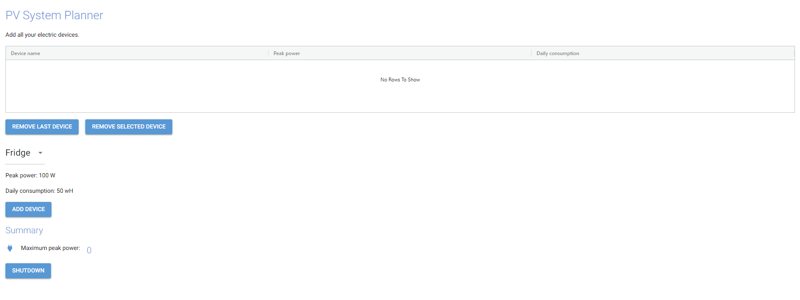

# Prerequisites
Python IDE

Python 3 version installed

Github account

# Tasks

## 1. Fork the repository

Use `git` to fork and clone repository.

## 2. Install dependancies

To install dependencies using `requirements.txtx`

⚔️ Side quest: Use virtual environment.

## 3. Run web application
When you run the web application you should see web page like this:

## 4. Familiarise yourself with the code

Briefly describe the project structure. What are the responsibilities of main elements?

## 5. Run tests
Run tests to figure out which tests are failing.

## 6. Create fix-tests branch
From `main` create branch to fix broken tests.

Fix the failing tests.

Push the branch and make a pull request.

Merge pull request.

## 7. Create new test from requirements
From `main` create branch to implement test from the requirements.

Find the function stub in the code and implement the test.

Push the branch and make a pull request.

Merge pull request. 

## 8. Create new test of your own
Think of and create a simple new test.

From `main` create branch to implement your own test.

Find the function stub in the code and implement the test.

Push the branch and make a pull request.

Merge pull request.

## 9. Run the pipeline
Go to Github and run the pipeline on your branches.
